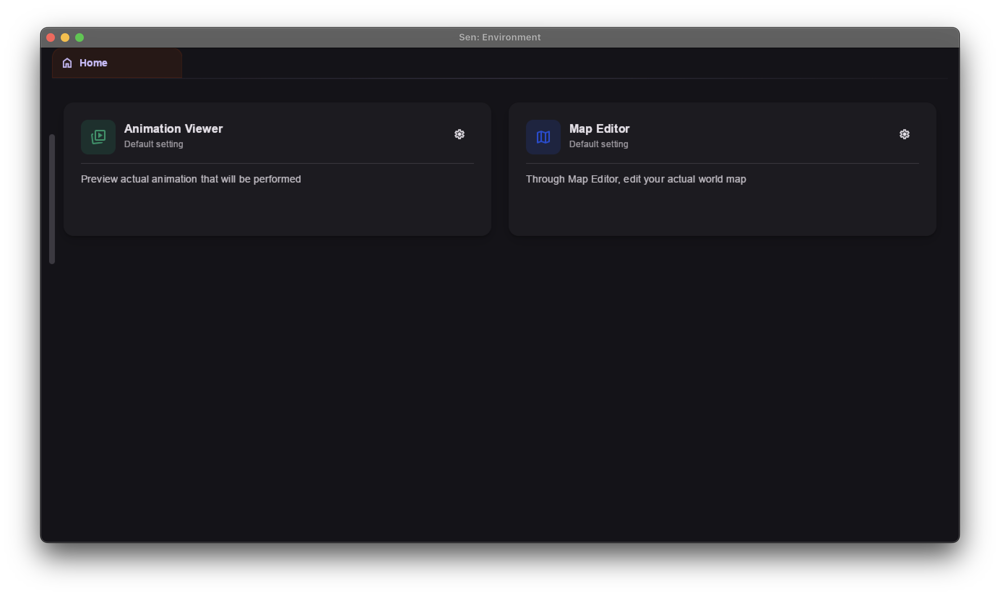

# Sen-Wined
Sen, A PVZ2 Modding Tool for MacOS using ~~Wine64~~/Crossover as a port.

**Original: https://senharuma.com/ (by https://github.com/harumazzz)**

**Crossover: https://www.codeweavers.com/ (by CodeWeavers)**

---

---

# DISCLAIMER: This is not a infringement on Sen's Code which is Closed Source, it is merely a wine bottle (used to run Windows applications on MacOS) running a modified, pre-installed requirements for the files downloadable from the Sen website.

# DISCLAIMER: This can only be used with Crossover (for now), a Paid App made by CodeWeavers.

---
## How does it work?

## Version Comparison (win-modding-gui)

| Version | ~~Open-Source Wine Build (WIP)~~ | CrossOver 26 Build (Via Building Yourself |
|---|---|---|
| **Engine** | ~~Open-Source Wine 7.7~~ | CrossOver 26 (`cxoffice-26.3.0rc2`) |
| **Graphics Backend** | ~~Vulkan / MoltenVK~~ | Apple D3DMetal + DXVK cxaddon |
| **Architecture Routing** | ~~Rosetta 2 (`arch -x86_64`)~~ | Built-in Multi-arch Wrapper |
| **Dependencies** | ~~None — 100% Self-contained~~ | CrossOver (Visual C++ and Windows Desktops |

---

## How to install and build (Crossover)

0. Install the latest win-modding-gui-crossover.zip (NOT THE OFFICIAL ONE), and ~~pirate like a chud~~ buy CrossOver
1. Make a new cask in CrossOver
2. Install Microsoft Visual C++ Redistruitable Latest (64 bit)
3. Install Microsoft Window Desktop Runtime Latest or 9.0.8 (64 bit)
4. Install icu.dll and place it in yourcaskscdrive/windows/system32
5. Run the app using Run Command and run modding.exe
6. Turn on Apple D3DMetal/DXVK (depends on what works)
7. (Optional): You can also install win-x64 and win-scg-downloader from the official link, as both work just fine with crossover, no strings attached.

## How to install (App Version)

0. TBA

## How to install (Wine Version)

0. TBA

---

## Q&A + Troubleshooting

### What is the point of the given win-modding-gui-crossover.zip if i can just download from the official one?

The official one is unable to run due to some problems involving some of the dlls, which causes it to crash immediately. This version ~~that I took half a year of trial and error~~ fixes all of that (for the most part).

### Will this update accordingly as Sen updates?

Yes. I am planning to make a launcher version to install and update Sen automatically, as well as add the patch for Wine/Crossover to run it.

### Does this tamper with any files of Sen in any way (Deleting features, etc)?

No. It is only a port spent for Crossover to run.

### Apple said it is malicious when trying to install the app!

You need to pay for the app to be verified (Classic Apple...), just go to Settings -> Security/Privacy -> Install Application Anyway
